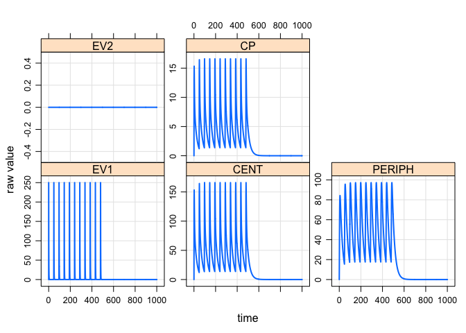
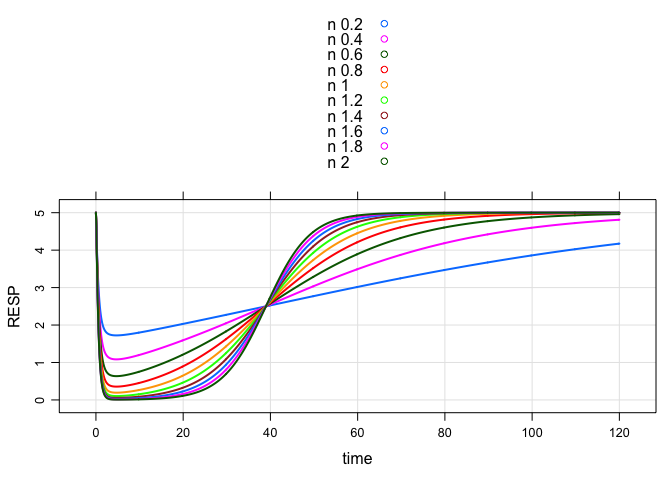

modmrg
======

A package of models in `mrgsolve` format.

Example
-------

``` r
library(modmrg)
```

    . Loading required package: mrgsolve

    . mrgsolve: Community Edition

    . www.github.com/metrumresearchgroup

``` r
mod <- pk2cmt()

mod
```

    . 
    . 
    . -------- mrgsolve model object (unix) --------
    .   Project: /Users/kyleb/Rlibs/lib/modmrg/project
    .   source:        pk2cmt.cpp
    .   shared object: modmrg (loaded)
    . 
    .   compile date:  
    .   Time:          start: 0 end: 24 delta: 1
    .   >              add: <none>
    .   >              tscale: 1
    . 
    .   Compartments:  EV1 CENT PERIPH EV2 [4]
    .   Parameters:    CL VC KA1 KA2 Q VP
    .   >              VMAX KM [8]
    .   Omega:         0x0 
    .   Sigma:         0x0 
    . 
    .   Solver:        atol: 1e-08 rtol: 1e-08
    .   >              maxsteps: 2000 hmin: 0 hmax: 0

``` r
param(mod)
```

    . 
    .  Model parameters (N=8):
    .  name value . name value
    .  CL   1     | Q    2    
    .  KA1  1     | VC   10   
    .  KA2  1     | VMAX 0    
    .  KM   2     | VP   10

``` r
init(mod)
```

    . 
    .  Model initial conditions (N=4):
    .  name       value . name         value
    .  CENT (2)   0     | EV2 (4)      0    
    .  EV1 (1)    0     | PERIPH (3)   0

``` r
mod %>%
  ev(amt=250, ii=48, addl=10) %>% 
  mrgsim(end=1000 )%>% 
  plot
```

<!-- -->

``` r
mod <- irm1()
see(mod)
```

    . 
    . Model file:  irm1.cpp 
    . $PARAM
    . CL=1, VC=10, KA1=0.5, KA2=0.5
    . Q = 0, VP=10
    . KIN = 10, KOUT=2, IC50 = 2, IMAX=1
    . VMAX = 0, KM=2, n=1
    . 
    . $INIT EV1 = 0, CENT= 0, PERIPH = 0, RESP = 5, EV2=0
    . 
    . 
    . $GLOBAL
    . #define CP (CENT/VC)
    . #define CT (PERIPH/VP)
    . #define CLNL (VMAX/(KM+CP))
    . #define INH (IMAX*pow(CP,n)/(pow(IC50,n)+pow(CP,n)))
    . 
    . $MAIN
    . RESP_0 = KIN/KOUT;
    . 
    . $ODE
    . dxdt_EV1 = -KA1*EV1;
    . dxdt_EV2 = -KA2*EV2;
    . dxdt_CENT = KA1*EV1 + KA2*EV2 - (CL+CLNL+Q)*CP  + Q*CT;
    . dxdt_PERIPH = Q*CP - Q*CT;
    . dxdt_RESP = KIN*(1-INH) - KOUT*RESP;
    . 
    . $TABLE
    . table(CP)=CP;

``` r
mod %>% 
  ev(amt=750) %>% 
  Req(RESP) %>%
  knobs(n=seq(1,10,1)/5, delta=0.1, end=120) %>%
  plot
```

<!-- -->
